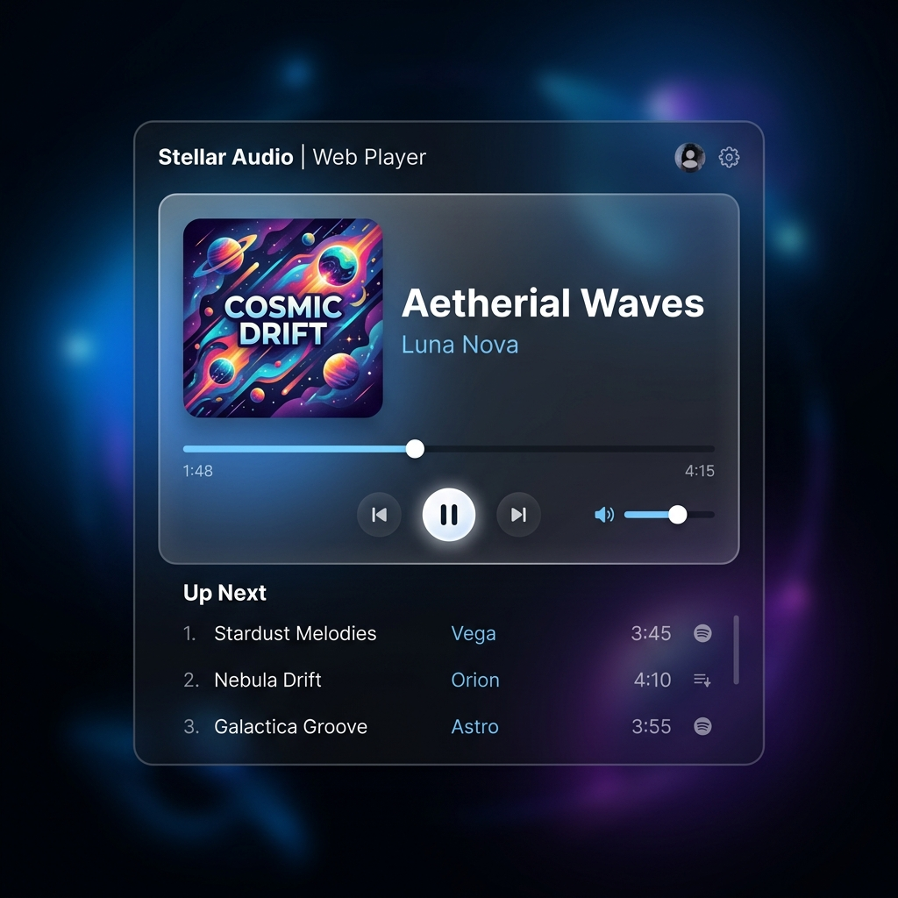

# Stellar Audio - Premium Music Experience

A sleek, modern, and fully functional music player web application built with HTML, CSS, and JavaScript.

## Features

- **Modern User Interface**: Features a premium, glassmorphism-inspired design with smooth animations.
- **Playback Controls**: Play, pause, skip to the next or previous track.
- **Progress Tracking**: Visual progress bar with current time and total duration displays.
- **Volume Control**: Adjustable volume slider.
- **Playlist Management**: View and select songs from a dynamic playlist.
- **Responsive Design**: Works beautifully across different devices and screen sizes.

## Technologies Used

- HTML5
- CSS3 (Variables, Flexbox, Grid, Animations)
- Vanilla JavaScript

## Setup Instructions

1. Clone this repository or download the files.
2. Open `index.html` in your modern web browser.
3. Enjoy the premium music experience!

## Future Enhancements

- Add support for uploading local audio files.
- Implement shuffle and repeat functionalities.
- Add audio visualization.

## Author

Govardhan Gantla
